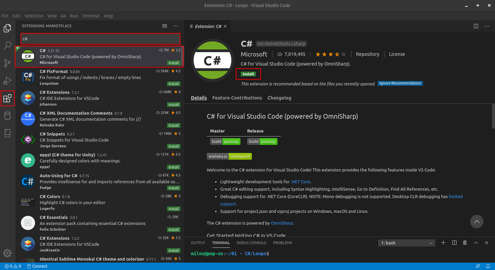

# VS Code on Ubuntu 19.10

From [**the official guide**](https://docs.microsoft.com/en-us/dotnet/core/install/linux-package-manager-ubuntu-1910) ****do following:

### Step 1. Register Microsoft key and feed <a id="register-microsoft-key-and-feed"></a>

Before installing .NET, you'll need to:

* Register the Microsoft key.
* Register the product repository.
* Install required dependencies.

This only needs to be done once per machine.

Open a terminal and run the following commands:

```bash
wget https://packages.microsoft.com/config/ubuntu/19.10/packages-microsoft-prod.deb -O packages-microsoft-prod.deb
sudo dpkg -i packages-microsoft-prod.deb
```

### Step 2. Install the .NET Core SDK

Update the products available for installation, then install the .NET Core SDK. In your terminal, run the following commands:

```text
sudo apt-get update
sudo apt-get install apt-transport-https
sudo apt-get update
sudo apt-get install dotnet-sdk-3.1
```

### Step 3. Download [VS Code](https://code.visualstudio.com/download) 

For our version of Linux distribution choose _**.deb 64 bit**_ package and install it

### Step 4. Install C\# Extension

Inside VS Code, under Extensions tab, install _**C\# for Visual Studio Code \(powered by OmniSharp\)**_ extension.



### Step 5. Recommended extensions:

* vscode-icons 
* Visual Studio IntelliCode
* NuGet Package Manager
* PackSharp
* Live Share Extension Pack - to share VS code screen 


