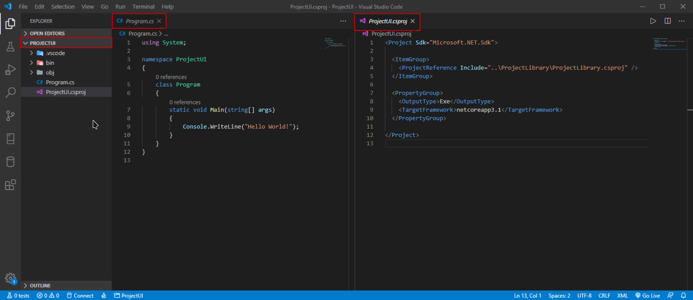

# Creating project with .NET CLI


Visit [Official documentation](https://docs.microsoft.com/en-us/dotnet/core/tools/) about .NET Core command-line interface \(CLI\) tools and commands.


To interact with .NET CLI tool we can type these commands in a command prompt or a shell or a terminal, depending of operating system in use, or in terminal inside VS Code.

Let's start .NET program we got when we installed .NET SDK:

Open **cmd** and type following commands:



```text
dotnet
```



```
Usage: dotnet [options]
Usage: dotnet [path-to-application]

Options:
  -h|--help         Display help.
  --info            Display .NET Core information.
  --list-sdks       Display the installed SDKs.
  --list-runtimes   Display the installed runtimes.

path-to-application:
  The path to an application .dll file to execute.
```



```

```





```text
dotnet --info
```



```
.NET Core SDK (reflecting any global.json):
 Version:   3.1.101
 Commit:    b377529961

Runtime Environment:
 OS Name:     Windows
 OS Version:  10.0.18363
 OS Platform: Windows
 RID:         win10-x64
 Base Path:   C:\Program Files\dotnet\sdk\3.1.101\

Host (useful for support):
  Version: 3.1.1
  Commit:  a1388f194c

.NET Core SDKs installed:
  2.1.802 [C:\Program Files\dotnet\sdk]
  3.0.100 [C:\Program Files\dotnet\sdk]
  3.1.101 [C:\Program Files\dotnet\sdk]

.NET Core runtimes installed:
  Microsoft.AspNetCore.All 2.1.13 [C:\Program Files\dotnet\shared\Microsoft.AspNetCore.All]
  Microsoft.AspNetCore.All 2.1.15 [C:\Program Files\dotnet\shared\Microsoft.AspNetCore.All]
  Microsoft.AspNetCore.App 2.1.13 [C:\Program Files\dotnet\shared\Microsoft.AspNetCore.App]
  Microsoft.AspNetCore.App 2.1.15 [C:\Program Files\dotnet\shared\Microsoft.AspNetCore.App]
  Microsoft.AspNetCore.App 3.0.0 [C:\Program Files\dotnet\shared\Microsoft.AspNetCore.App]
  Microsoft.AspNetCore.App 3.1.1 [C:\Program Files\dotnet\shared\Microsoft.AspNetCore.App]
  Microsoft.NETCore.App 2.1.13 [C:\Program Files\dotnet\shared\Microsoft.NETCore.App]
  Microsoft.NETCore.App 2.1.15 [C:\Program Files\dotnet\shared\Microsoft.NETCore.App]
  Microsoft.NETCore.App 3.0.0 [C:\Program Files\dotnet\shared\Microsoft.NETCore.App]
  Microsoft.NETCore.App 3.1.1 [C:\Program Files\dotnet\shared\Microsoft.NETCore.App]
  Microsoft.WindowsDesktop.App 3.0.0 [C:\Program Files\dotnet\shared\Microsoft.WindowsDesktop.App]
  Microsoft.WindowsDesktop.App 3.1.1 [C:\Program Files\dotnet\shared\Microsoft.WindowsDesktop.App]

To install additional .NET Core runtimes or SDKs:
  https://aka.ms/dotnet-download
```



```
provides with useful information if we need to troubleshoot our environment
```





```
dotnet --help
```



```text
C:\Development>dotnet --help
.NET Core SDK (3.1.101)
Usage: dotnet [runtime-options] [path-to-application] [arguments]

Execute a .NET Core application.

runtime-options:
  --additionalprobingpath <path>   Path containing probing policy and assemblies to probe for.
  --additional-deps <path>         Path to additional deps.json file.
  --fx-version <version>           Version of the installed Shared Framework to use to run the application.
  --roll-forward <setting>         Roll forward to framework version  (LatestPatch, Minor, LatestMinor, Major, LatestMajor, Disable).

path-to-application:
  The path to an application .dll file to execute.

Usage: dotnet [sdk-options] [command] [command-options] [arguments]

Execute a .NET Core SDK command.

sdk-options:
  -d|--diagnostics  Enable diagnostic output.
  -h|--help         Show command line help.
  --info            Display .NET Core information.
  --list-runtimes   Display the installed runtimes.
  --list-sdks       Display the installed SDKs.
  --version         Display .NET Core SDK version in use.

SDK commands:
  add               Add a package or reference to a .NET project.
  build             Build a .NET project.
  build-server      Interact with servers started by a build.
  clean             Clean build outputs of a .NET project.
  help              Show command line help.
  list              List project references of a .NET project.
  msbuild           Run Microsoft Build Engine (MSBuild) commands.
  new               Create a new .NET project or file.
  nuget             Provides additional NuGet commands.
  pack              Create a NuGet package.
  publish           Publish a .NET project for deployment.
  remove            Remove a package or reference from a .NET project.
  restore           Restore dependencies specified in a .NET project.
  run               Build and run a .NET project output.
  sln               Modify Visual Studio solution files.
  store             Store the specified assemblies in the runtime package store.
  test              Run unit tests using the test runner specified in a .NET project.
  tool              Install or manage tools that extend the .NET experience.
  vstest            Run Microsoft Test Engine (VSTest) commands.

Additional commands from bundled tools:
  dev-certs         Create and manage development certificates.
  fsi               Start F# Interactive / execute F# scripts.
  sql-cache         SQL Server cache command-line tools.
  user-secrets      Manage development user secrets.
  watch             Start a file watcher that runs a command when files change.

Run 'dotnet [command] --help' for more information on a command.
```



```
Provides with different SDK commands that are available with .NET
```




_**"Project** is a collection of source code files that are put together into a single application or a single library written to share code with other developers."_




```text
dotnet new
```



```
Usage: new [options]

Options:
  -h, --help          Displays help for this command.
  -l, --list          Lists templates containing the specified name. If no name is specified, lists all templates.
  -n, --name          The name for the output being created. If no name is specified, the name of the current directory is used.
  -o, --output        Location to place the generated output.
  -i, --install       Installs a source or a template pack.
  -u, --uninstall     Uninstalls a source or a template pack.
  --nuget-source      Specifies a NuGet source to use during install.
  --type              Filters templates based on available types. Predefined values are "project", "item" or "other".
  --dry-run           Displays a summary of what would happen if the given command line were run if it would result in a template creation.
  --force             Forces content to be generated even if it would change existing files.
  -lang, --language   Filters templates based on language and specifies the language of the template to create.
  --update-check      Check the currently installed template packs for updates.
  --update-apply      Check the currently installed template packs for update, and install the updates.


Templates                                         Short Name               Language          Tags
----------------------------------------------------------------------------------------------------------------------------------
Console Application                               console                  [C#], F#, VB      Common/Console
Class library                                     classlib                 [C#], F#, VB      Common/Library
WPF Application                                   wpf                      [C#]              Common/WPF
WPF Class library                                 wpflib                   [C#]              Common/WPF
WPF Custom Control Library                        wpfcustomcontrollib      [C#]              Common/WPF
WPF User Control Library                          wpfusercontrollib        [C#]              Common/WPF
Windows Forms (WinForms) Application              winforms                 [C#]              Common/WinForms
Windows Forms (WinForms) Class library            winformslib              [C#]              Common/WinForms
Worker Service                                    worker                   [C#]              Common/Worker/Web
Unit Test Project                                 mstest                   [C#], F#, VB      Test/MSTest
NUnit 3 Test Project                              nunit                    [C#], F#, VB      Test/NUnit
NUnit 3 Test Item                                 nunit-test               [C#], F#, VB      Test/NUnit
xUnit Test Project                                xunit                    [C#], F#, VB      Test/xUnit
Razor Component                                   razorcomponent           [C#]              Web/ASP.NET
Razor Page                                        page                     [C#]              Web/ASP.NET
MVC ViewImports                                   viewimports              [C#]              Web/ASP.NET
MVC ViewStart                                     viewstart                [C#]              Web/ASP.NET
Blazor Server App                                 blazorserver             [C#]              Web/Blazor
ASP.NET Core Empty                                web                      [C#], F#          Web/Empty
ASP.NET Core Web App (Model-View-Controller)      mvc                      [C#], F#          Web/MVC
ASP.NET Core Web App                              webapp                   [C#]              Web/MVC/Razor Pages
ASP.NET Core with Angular                         angular                  [C#]              Web/MVC/SPA
ASP.NET Core with React.js                        react                    [C#]              Web/MVC/SPA
ASP.NET Core with React.js and Redux              reactredux               [C#]              Web/MVC/SPA
Razor Class Library                               razorclasslib            [C#]              Web/Razor/Library/Razor Class Library
ASP.NET Core Web API                              webapi                   [C#], F#          Web/WebAPI
ASP.NET Core gRPC Service                         grpc                     [C#]              Web/gRPC
dotnet gitignore file                             gitignore                                  Config
global.json file                                  globaljson                                 Config
NuGet Config                                      nugetconfig                                Config
Dotnet local tool manifest file                   tool-manifest                              Config
Web Config                                        webconfig                                  Config
Solution File                                     sln                                        Solution
Protocol Buffer File                              proto                                      Web/gRPC

Examples:
    dotnet new mvc --auth Individual
    dotnet new worker
    dotnet new --help
```



```
Providing us with template options for new project with basic structure for an application with .NET CLI)
```



Before creating a new project, let's first create  NewProject folder : **mkdir NewProject**



```text
mkdir NewProject
```



```
No output in console.
```



```
creates new folder
```





```text
cd NewPoject
```



```
No output in console.
```



```
Swithes to to folder.
```



First we create a _**Solution**_ file: 



```text
dotnet new sln -n "NewProjectSln"
```



```
The template "Solution File" was created successfully.
```



```
Crates new solution file with given name.
```



Let's now create a new **Console** project



```text
dotnet new console -n "ProjectUI"
```



```
The template "Console Application" was created successfully.

Processing post-creation actions...
Running 'dotnet restore' on ProjectUI\ProjectUI.csproj...
  Restore completed in 123.56 ms for C:\Development\ProjectUI\ProjectUI.csproj.

Restore succeeded.
```



```
Creates new project of type Console with given name.
```



Let's create a new **Class Library**



```text
dotnet new classlib -n "ProjectLibrary"
```



```
The template "Class library" was created successfully.

Processing post-creation actions...
Running 'dotnet restore' on ProjectLibrary\ProjectLibrary.csproj...
  Restore completed in 216.25 ms for C:\Development\ProjectLibrary\ProjectLibrary.csproj.

Restore succeeded.
```



```
Creates new project of type Class Library with given name.
```



Now we have to put console and class library projects, one by one,  **into our Solution file**:

Add console project file to solution file:



```text
dotnet sln NewProjectSln.sln add ./ProjectUI/ProjectUI.csproj
```



    Project `ProjectUI\ProjectUI.csproj` added to the solution.



Add class library file to solution file:



```text
dotnet sln NewProjectSln.sln add ./ProjectLibrary/ProjectLibrary.csproj
```



    Project `ProjectLibrary\ProjectLibrary.csproj` added to the solution.



To reference project ProjectUI.csproj to class library ProjectLibrary.csproj do following:



```text
dotnet add ProjectUI/ProjectUI.csproj reference ProjectLibrary/ProjectLibrary.csproj
```



    Reference `..\ProjectLibrary\ProjectLibrary.csproj` added to the project.



We can now run VS Code to work on our project ProjectUI.csproj, from our project folder ProjectUI, so we   


1. list all directories:



```text
C:\Development\NewProject>dir
```



```
 Volume in drive C has no label.
 Volume Serial Number is 065E-2312

 Directory of C:\Development\NewProject

28/03/2020  23:24    <DIR>          .
28/03/2020  23:24    <DIR>          ..
28/03/2020  23:09             2,862 NewProjectSln.sln
28/03/2020  23:05    <DIR>          ProjectLibrary
28/03/2020  23:03    <DIR>          ProjectUI
21/03/2020  00:09            24,676 Solution file.docx
               2 File(s)         27,538 bytes
               4 Dir(s)  10,586,243,072 bytes free
```



2. Navigate to project folder:

```text
cd ProjectUI
```

3. Open VS Code from project folder:

```text
Code .
```


_Click **Yes** when message "Required assets to build and debug are missing from 'ProjectUI'. Add them?" pops up from VS Code._


The result:



