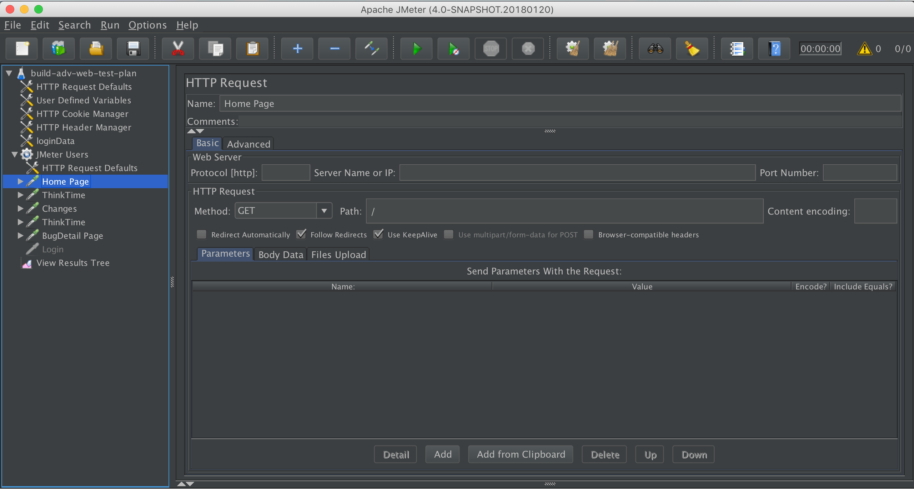
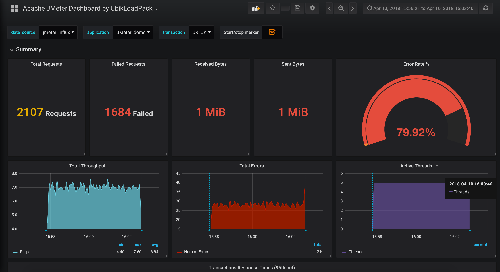

# Example

Apache JMeter may be used to test performance both on static and dynamic resources, Web dynamic applications.  
It can be used to simulate a heavy load on a server, group of servers, network or object to test its strength or to analyze overall performance under different load types.  

Apache JMeter features include:

* Ability to load and performance test many different applications/server/protocol types:
  * Web - HTTP, HTTPS \(Java, NodeJS, PHP, ASP.NET, …\)
  * SOAP / REST Webservices
  * FTP
  * Database via JDBC
  * LDAP
  * Message-oriented middleware \(MOM\) via JMS
  * Mail - SMTP\(S\), POP3\(S\) and IMAP\(S\)
  * Native commands or shell scripts
  * TCP
  * Java Objects

Reporting example.. 

