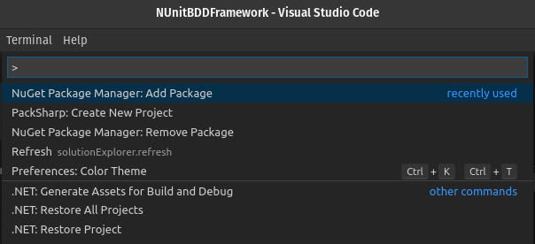

# .. in VS Code

## Basic Setup


Prerequisites: 

* [x] [VS Code installed](../../../../linux/untitled.md)
* [x] [.NET Core SDK installed](../../../../linux/untitled.md)


## Creating an Automation Test Project in VS Code

#### Step 1: Open terminal in suitable location for the project

#### Step 2: Create a new directory for the project and navigate to it

```csharp
mkdir NUnitBDDFramework
```

```csharp
cd NUnitBDDFramework
```

#### Step 3: Launch VS Code in the current directory

```csharp
code .
```

#### Step 4: In VS Code open integrated _bash_ terminal

#### Step 5: Create a new project with name NUnitBDDProject

```csharp
dotnet new nunit --name NUnitBDDProject
```

#### Step 6: Create Solution file with name ProjectSolution 



```csharp
dotnet new sln --name ProjectSolution
```



```

```



#### Step 7: Add NUnitBDDProject to ProjectSolution 



```csharp
dotnet sln add NUnitBDDProject
```



    Project `NUnitBDDProject/NUnitBDDProject.csproj` added to the solution.




Note: When VSCode promt you to add missing assets to build and devug, click Yes and **.vscode** folder will be added to the framework.


## Installing dependencies


_To install **NuGet** **packages** hit **F1** to open menu and choose **NuGet Package Manager: Add package** and search for package_






_To install **NuGet packages** from the terminal:_

**`dotnet  add`**`Project-folder-name/Project-name.csproj`**`package`**`Package-name`


#### Step 1: Add NUnit3TestAdapter  using F1 or from the terminal \(will add latest version\)

```csharp
dotnet add NUnitBDDProject/NUnitBDDProject.csproj package Nunit3testAdapter
```

#### Step 2: package

